# Ollivanders Shop — REST API

**Table of contents**

- [Ollivanders Shop — REST API](#ollivanders-shop--rest-api)
  - [Introduction](#introduction)
    - [Database schema](#database-schema)
  - [How to install](#how-to-install)
  - [How to use](#how-to-use)
  - [Testing and development](#testing-and-development)
    - [Requirements for developers](#requirements-for-developers)
    - [Pytest](#pytest)
    - [Coverage](#coverage)
    - [Black](#black)
    - [Bandit](#bandit)
    - [Tox](#tox)
  - [Docker](#docker)

## Introduction

Ollivanders Shop is a [REST API](https://en.wikipedia.org/wiki/Representational_state_transfer) that allows you to make [CRUD](https://en.wikipedia.org/wiki/Create,_read,_update_and_delete) operations (such as get, update, create, or delete data from a database) using the website created for it. This website will allow you to see the content of the database and choose if you want to update it, insert new data, or delete an already existing one, by just hitting a button (and if neccessary, write the data asked to do such operations).   

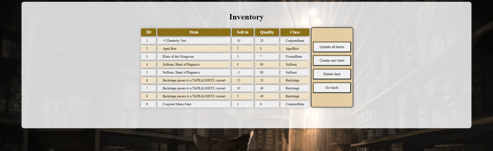

I will leave the [link to the project](https://github.com/dfleta/flask-rest-ci-boilerplate) statement to those curious about the instructions we were given.   

### Database schema

The database has one table with five fields: ```id```, ```name```, ```sell_in```, ```quality```, and ```class_object```.   

```id``` refers to the ID of the item, and it will assigned automatically to each new item.   
```name``` refers to the name of the item.   
```sell_in``` refers to the number of days until the item is sold.   
```quality``` refers to the quality of the object, which increases or decreases (depending on its class) as the days pass.   
```class_object``` refers to the type of the item, which will determine how the item's quality changes.   

Here is a sample of what the database's table will look like:   

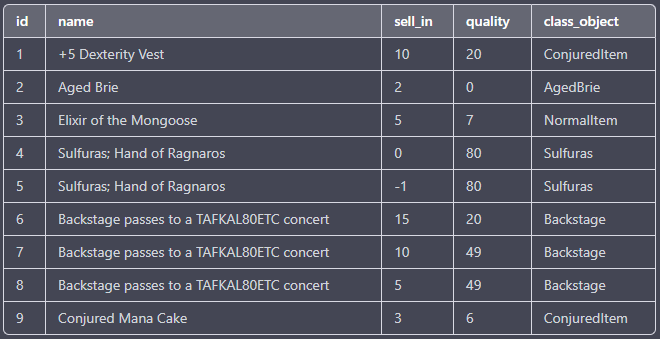

## How to install

The first thing you need to know is that you don't to install or create an account for any database, as Ollivanders uses an [SQLite database](https://docs.python.org/3/library/sqlite3.html). SQLite, or more precisely ```sqlite3```, is a module in Python's standard library that provides a simple and efficient way to interact with SQLite databases from within Python programs. This means that you only will need to execute one command to create your local database.   

However, you will need to have installed before proceeding: ```Git```, ```Python```, and ```pip```.

**IMPORTANT:** There's also a Docker version of this application using a MySQL database in a Docker container. This version surged due to an assignment in *Sistemas Informáticos* (Computer Systems), which asked us to connect two Docker containers (one of a database, and another of a web application) with each other. The repository, along with the instructions to install and use it, can be found in [this link](https://github.com/ncocana/ollivanders-shop-api-rest-Docker-MySQL).

Let's start the tutorial:

1. First, create a directory/folder in which you will store the application. If you doing this with the terminal, you will need to use this commands:

    ```
    mkdir .\ollivanders
    cd ollivanders
    ```

2. Clone the repository inside that directory.

    ```
    git clone https://github.com/ncocana/ollivanders-shop-api-rest.git
    ```

3. Create a virtual environment and move inside it. This is an important step because it allows you to create an isolated environment for this project, with its own set of dependencies, without interfering with other Python projects or the system Python installation.

    ```
    python -m venv venv
    ```

4. Move inside the virtual environment. Depending on what terminal you're on, you will need to execute the required file. For Windows Powershell, it will be the one with extension ".ps1"; for the CMD, it will be ".bat"; and for Unix or MacOS, it will be called "activate". In this case, I will use the Powershell one:

    ```
    .\venv\Scripts\Activate.ps1
    ```

    It's possible that, when executing this command, you get an error along the lines of "cannot be loaded because the execution of scripts is disabled on this system". If this happens, you will need to open Windows Powershell as administrator and execute the following command. When asked if you're sure, say "yes". This will allow you to execute scripts on your PC, such as the one you need to activate the virtual environment.

    ```
    Set-executionpolicy remotesigned
    ```

5. Install the requirements. There are two type of requirements: ```requirements.txt``` for the requirements needed for the project to function properly, and ```dev-requirements.txt``` for the requirements needed for testing and development. For now, we will install just ```requirements.txt```.

    ```
    pip install -r requirements.txt
    ```

## How to use

1. Make sure you're inside the virtual environment. A green ```(venv)``` should appear in the terminal at the left of your current path.

    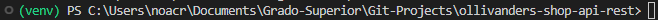

2. If it's the first time you execute Ollivanders, execute the ```init-db.py``` file. This file will create the ```sqlite3``` database in the array directory of the project and introduce some mock data into the database.

    ```
    python .\database\init_db.py
    ```

    If you just want an empty database, you can comment or erase the lines used to insert the mock data.

3. Run the following command to initialize the app:

    ```
    flask --debug run
    ```

4. Click on the IP showed on the terminal (or write the IP on your brower) to access the website.

    ```
    * Running on http://127.0.0.1:5000
    ```

    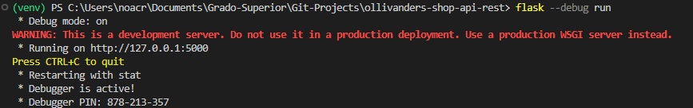

5. The website's interface is simple and intuive enough to know what to do without more guidance. You just need to click on the button of your choice to perform the CRUD operations you want. And remember, swish and flick!   

    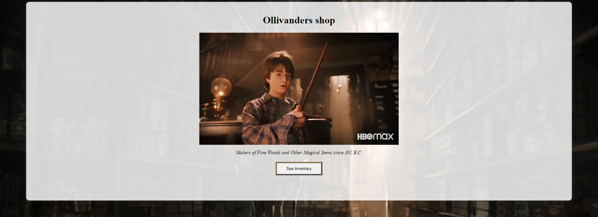

## Testing and development

### Requirements for developers

For executing the tests and others packages of similar nature, you will need to install the requirements for developers mentioned previously:

```
pip install -r dev-requirements.txt
```

### Pytest

Pytest is a testing framework for Python. It allows developers to write unit tests and functional tests for their Python code in a simple and easy-to-use manner. Pytest provides many useful features such as fixtures, parametrization, and assertions.   

To execute it, write on the terminal:   

```
pytest
```

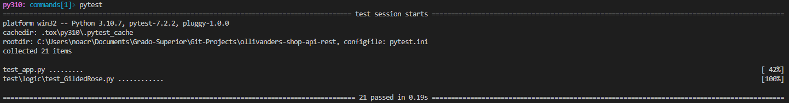

### Coverage

Coverage is a tool for measuring the amount of code that is executed during automated tests. It provides a way to determine which parts of a codebase are being tested and which are not, which can help developers identify gaps in their test coverage and improve the overall quality of their code.   

As you can see, through multiple tests, I managed to achieve a coverage of 100%, making sure that all the code is being tested and it works as it should. There's a few files that are excluded from coverage through the ```.coveragerc``` file, such as tests, the ```setup.py``` file, and the ```init_db.py``` file. The reason to exclude this one is because is intended to execute through the ```python``` prompt and it would be difficult to test it as such without modify it; there is, however, a try/except statement to handle potential errors that may arise when connecting to the database or executing the SQL query to insert the mock data. These try/except statements are also excluded from coverage.   

To execute Coverage, write on the terminal:   

```
coverage run --source ./ -m pytest
coverage report
```

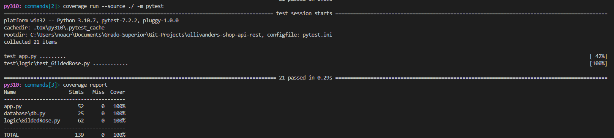

### Black

Black is a code formatter for Python that reformats your code according to a set of predefined rules. It takes as input a Python code file and outputs a version of that file with consistent formatting, such as indentation, line length, and whitespace. Black is designed to be highly opinionated and strives to produce code that is consistent, readable, and easy to maintain.   

To execute Black, write on the terminal:   

```
black .
```

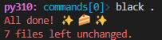

### Bandit

Bandit is a security linter tool for Python that analyzes your code for potential security vulnerabilities. It checks for common security issues, such as SQL injection, cross-site scripting (XSS), and command injection, among others. Bandit uses static analysis techniques to scan your code and identify potential security problems, making it a valuable tool for ensuring that your code is secure and safe to run.   

In my case, I have told bandit to analyze the folders and files concerning my project, leaving out those pertaining to configuration and other packages. I have also told it to skip the tests B101 and B307. B101 and B307 are security issues identifiers in Bandit that refers to the detection of certain vulnerabilities in my code.   

[B101](https://bandit.readthedocs.io/en/latest/plugins/b101_assert_used.html) detects the use of "assert" statements and flags them as a potential security issue, as an attacker may be able to disable or bypass the "assert" statement and exploit the underlying vulnerability. As I use asserts in my tests, I decided to exclude B101 from the analisys.   

[B307](https://bandit.readthedocs.io/en/latest/blacklists/blacklist_calls.html#b307-eval) detects the use of ```eval()``` as a possibly insecure function. I tried to find alternatives to ```eval()```, but either they didn't work, or were too complicated to even try. So unfortunately, I ended up giving up and decided to exclude B307 from the analisys for the time being.   

To execute Bandit, write on the terminal:   

```
bandit -r ./database/ ./logic/ ./test/ ./app.py ./test_app.py --skip B101,B307
```

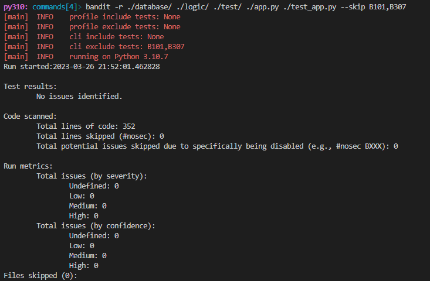

### Tox

Tox is a tool for automating the testing and building of Python packages across multiple environments. It allows you to define a set of virtual environments, each with its own Python version and dependencies, and then run a series of tests or commands against each of these environments.   

All the images that you have seen until now in this section are outputs from Tox.   

To execute Tox, write on the terminal:   

```
tox
```

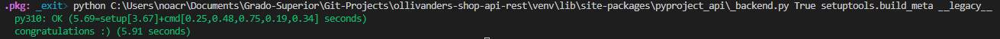

## Docker

A Dockerfile is a text file that contains instructions for building a Docker image. It is a script that automates the creation of a Docker image, which is a lightweight, standalone, and executable package that includes everything needed to run an application, such as code, libraries, and system tools.   

You can use the Dockerfile in this repository to create a Docker image, which in turn can be used to create a Docker container for this application.   

1. Assuming you already cloned the repository, make sure you're into the project's directory and that you have Docker installed.

2. Build the Docker image by running the following command. This will create a Docker image with the tag "ollivanders-rest-api".

    ```
    docker build -t ollivanders-rest-api .
    ```

    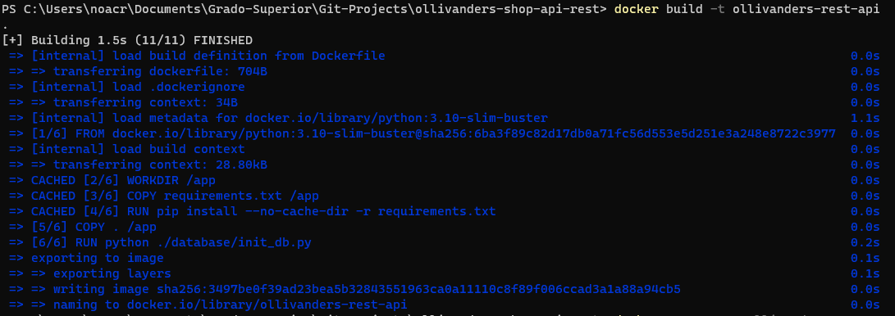

    You can view the image created with the command: ```docker images```.   

3. Now, run the Docker container using the following command. This will start the Flask application inside the Docker container and map port 5000 from the container to port 5000 on your local machine, allowing you to access the Flask application in your web browser at [http://localhost:5000](http://localhost:5000) or [http://127.0.0.1:5000/](http://127.0.0.1:5000/).

    ```
    docker run --name=ollivanders -p 5000:5000 -d ollivanders-rest-api:latest
    ```

    You can view the container created with the command: ```docker ps -a``` (this will show you all the containers, running or not. To view only the ones running at the moment: ```docker ps```).   

    You can enter the container with: ```docker exec -it ollivanders sh```.   

    To view the logs of the container: ```docker logs ollivanders```.   
